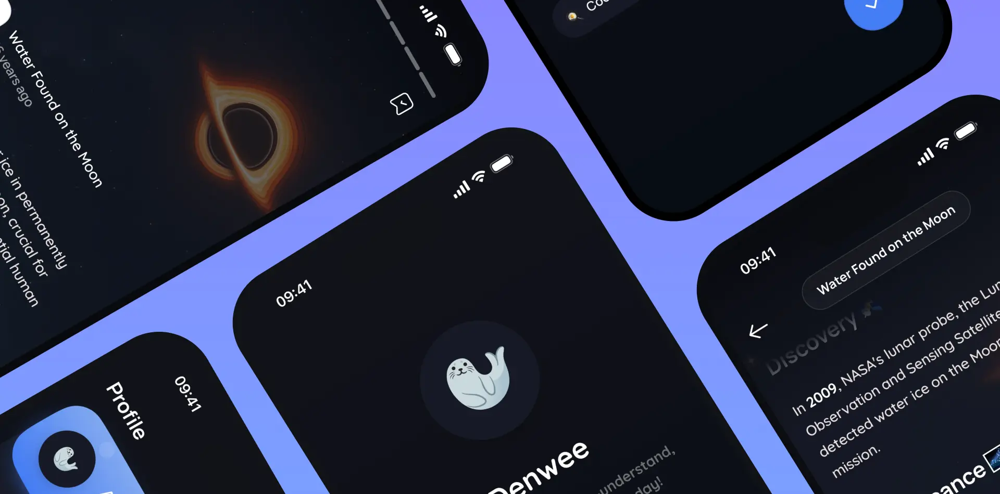

<h1 align="center">
  Denwee App
  <br>
</h1>

<h4 align="center">Discover short, easy-to-understand, memorable facts every day!</h4>

<p align="center">
  <a href="https://apps.apple.com/ua/app/denwee/id6756196669">
    
  </a>
  <a href="https://play.google.com/store/apps/details?id=app.denwee.factlyapp">
    
  </a>
</p>


<p align="center">
  <a href="https://www.denwee.com">
    
  </a>
</p>


> Denwee is an open-source mobile application built with Flutter. It delivers personalized daily facts based on user-selected interests and supports push notifications, localization, and a modular, scalable architecture inspired by SOLID principles.


## 🎨 Features

- Daily facts delivery with [Supabase](https://supabase.com) and [ChatGPT Batch API](https://platform.openai.com/docs/guides/batch)
- Push notifications using [Firebase Cloud Messaging](https://firebase.google.com/docs/cloud-messaging)
- Synced user accounts via [Supabase Auth](https://supabase.com/docs/guides/auth)
- Analytics and crash reporting with [Firebase Analytics](https://firebase.google.com/products/analytics) and [Crashlytics](https://firebase.google.com/products/crashlytics)
- Multi-language support with [Easy Localization](https://pub.dev/packages/easy_localization)


## 🛠 Tech Stack

| Layer      | Technologies | Description |
|----------- |--------------|-------------|
| **Frontend (Open Source)** | Flutter, Dart, Firebase Cloud Messaging, Localizations | Client app, responsible for UI, notifications, localization, and user interactions |
| **Backend (Closed Source)** | Supabase, PostgreSQL, Supabase Edge Functions, ChatGPT API (Batch), Cron/Scheduled Jobs | Handles authentication, facts generation, data storage, multi-device token management, and notification scheduling |
| **Infrastructure** | Supabase (Database, Auth, API)<br>Firebase (Push Notifications, Analytics, Crashlytics) | Manages user accounts, data, push notifications, analytics, and crash reporting |


## 📦 Primary Packages

| Package | Purpose |
|---------|---------|
| [flutter_bloc](https://pub.dev/packages/flutter_bloc) | State management |
| [get_it](https://pub.dev/packages/get_it) | Dependency injection |
| [app_links](https://pub.dev/packages/app_links) | Deep links |
| [drift](https://pub.dev/packages/drift) | Local database |
| [dio](https://pub.dev/packages/dio) | Network requests |
| [easy_localization](https://pub.dev/packages/easy_localization) | Multi-language support |
| [animate_do](https://pub.dev/packages/animate_do) | Animations |


## 🖌️ Assets

- **Static icons** from [Iconsax](https://iconsax.io)  
- **Animated emojis** from [Noto Animated Emojis](https://googlefonts.github.io/noto-emoji-animation/) — licensed under [CC BY 4.0](https://creativecommons.org/licenses/by/4.0/legalcode)  
- **Fonts:** [Manrope](https://fonts.google.com/specimen/Manrope) (Primary), [Quicksand](https://fonts.google.com/specimen/Quicksand) (Secondary)


## 🚀 How To Run

To run this application, you'll need [Flutter](https://flutter.dev) of version `3.35` or higher:

```bash
# Get all packages
flutter pub get

# Generate localization files
flutter pub run easy_localization:generate -S "assets/translations" -O "lib/localization"

# Generate localization keys
flutter pub run easy_localization:generate -S "assets/translations" -O "lib/localization" -o "locale_keys.g.dart" -f keys

# Build runner
dart run build_runner build --delete-conflicting-outputs

# Run dev environment
flutter run --flavor dev -t lib/main_dev.dart

# Run prod environment
flutter run --flavor prod -t lib/main_prod.dart
```


## 🤝 How To Contribute

Denwee projects are crafted by a solo enthusiastic developer across Mobile, Web, and Backend technologies. Your contributions, no matter how big or small, are always welcome! Here’s how you can help:

* **Open PR's** – fix bugs, add features, or improve existing code.
* **Submit Issues** – report bugs, request features, or suggest improvements.


## 🌐 You May Also Like

Explore the **Denwee App landing page**, built with Flutter Web. This simple landing page is also open-source 🔥 [Check it out](https://github.com/denweeLabs/factlyapp-landing)


## 🏆 Credits

Some design elements and animations were inspired by [Reflectly App](https://reflectlyapp.com), adapted and implemented originally for Denwee. Definitely check out their awesome product!


## ❤️ Support

For any questions or support, please reach out to support@denwee.com 🫶

<a href="https://buymeacoffee.com/denweelabs" target="_blank"></a>


## 📃 License

[](https://opensource.org/licenses/MIT)
